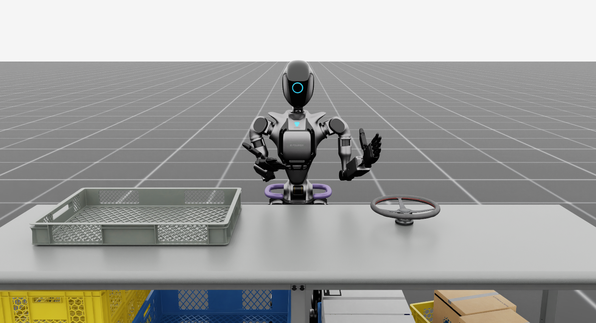

# Hierarchal LLM-guided Symmetry-aware Bimanual Manipulation

[](https://docs.omniverse.nvidia.com/isaacsim/latest/overview.html)
[](https://isaac-sim.github.io/IsaacLab)
[](https://docs.python.org/3/whatsnew/3.11.html)
[](https://releases.ubuntu.com/22.04/)
[](https://pre-commit.com/)
[](https://opensource.org/license/mit)

## Overview

Groot is a hierarchical framework that uses LLMs to generate subgoals and RL controllers to execute them for efficient bimanual manipulation in simulation. Built on Isaac Lab, it targets long-horizon, high-dimensional tasks.

  

#### Motivation and Background
- Long-horizon bimanual tasks (e.g., folding cloth, opening jars) are challenging for standard reinforcement learning (RL) due to the large state–action spaces involved.
- Existing LLM-based planners (such as LABOR, LLM+MAP) typically depend on scripted skills, which can limit flexibility and generalization.

#### Goal of the Project
- This project aims to develop a hierarchical framework in which a large language model (LLM) generates symmetry-aware subgoals, and RL controllers execute these subgoals.
- The approach is designed to improve both efficiency and generalization in complex bimanual manipulation tasks.

#### Dataset
- The framework utilizes Isaac Lab’s simulated bimanual manipulation tasks.
- **Input**: State information, including humanoid joint configurations and object positions.
- **Output**: Subgoals for execution by RL controllers.

</br>

**Keywords:** bimanual manipulation, LLM-based hierarchical reinforcement learning, isaaclab  
**Author:** [Sol Choi](https://github.com/S-CHOI-S)

</br>

## Installation

**Step 1.** Clone this git repository
```
git clone --recursive https://github.com/dddongri/MEU6505_Project_6.git project6
```

**Step 2.** (Optional) Rename all occurrences of groot (in files/directories) to `your_fancy_extension_name`
```
python scripts/rename_template.py your_fancy_extension_name
```

**Step 3.** Install Isaac Lab, see the [installation guide](https://isaac-sim.github.io/IsaacLab/source/setup/installation/index.html)

**Step 4.** Using a python interpreter that has Isaac Lab installed, install the library
- `groot` library
    ```
    cd source/groot
    python -m pip install -e .
    ```


</br>

## Usage
### Train
**Step 1.** Check out the environments available in the _groot_ project.
```
python scripts/list_envs.py
```
- Existing Tasks
    - Template-Isaac-Velocity-Flat-Anymal-D-v0
    - Template-Isaac-Velocity-Rough-Anymal-D-v0
    - **GR1T2-Basic**

**Step 2.** Start training with groot `TASK`!
```
python scripts/rsl_rl/train.py --task TASK --headless
```
>[!Tip]
> MEU6505_Project_6 is compatible with `rsl_rl`, `Stable Baselines3`, as well as custom reinforcement learning algorithms.

</br>

### Play
**Step 1.** Choose your `TASK` and `LOGDIR` from your log.
```
python scripts/rsl_rl/play.py --task TASK --log_dir LOGDIR --num_envs NUM_ENVS
```
>[!Tip]
> If `LOGDIR` is not set, the latest log directory is loaded automatically!

</br>

### Monitor
You can monitor real-time training logs via TensorBoard!
```
tensorboard --logdir logs/rsl_rl/TASK/
```


</br>

## Code formatting

We have a pre-commit template to automatically format your code.
To install pre-commit:

```bash
pip install pre-commit
```

Then you can run pre-commit with:

```bash
pre-commit run --all-files
```